# Populate Manual for MS20-VCF

Follow this manual to populate the PCB: 

The basic rule is, always go from the smallest to the highest component on the board !

####  This is the front side of the board we are populating

####  This is the back side of the board we are populating, and we are gonna start by this side.

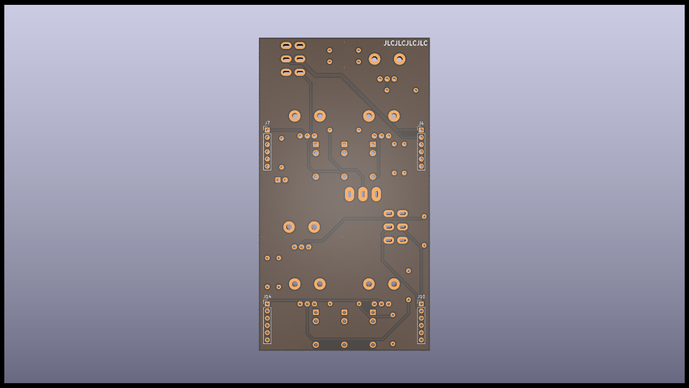

####  Start by the SMD components, here U1. 

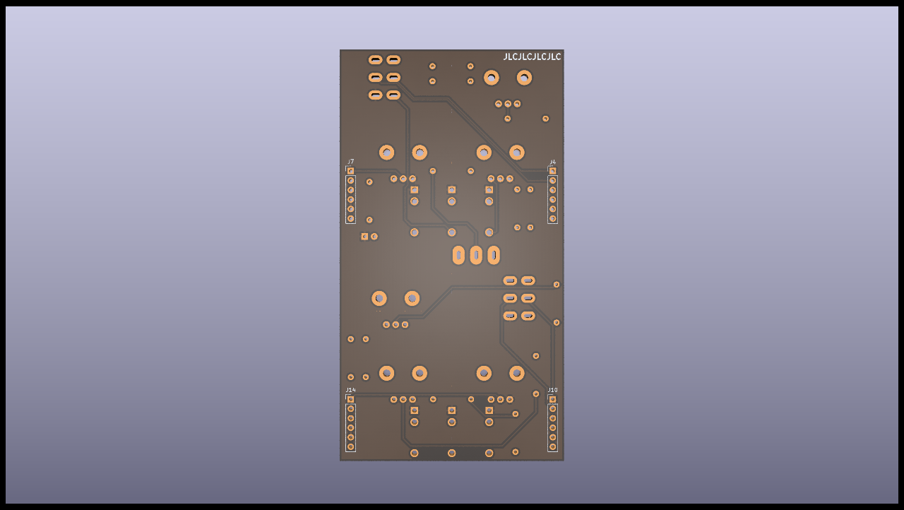

####  After U1, do the beads and the resistor

####  Do all the ceramic capacitors

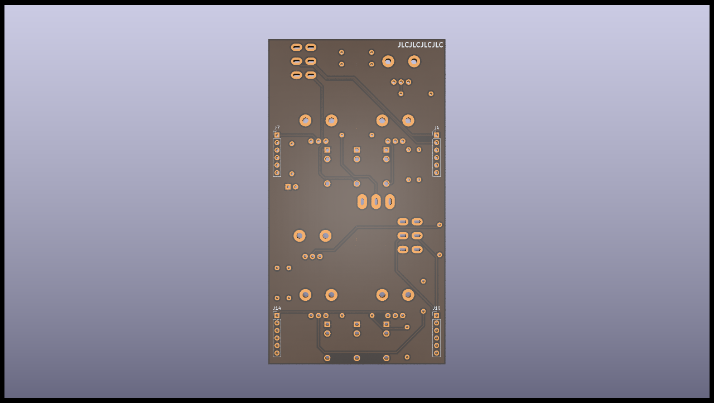

####  Finish the capacitors with the electrolytic ones, watch out for their orientation, they are polarized.

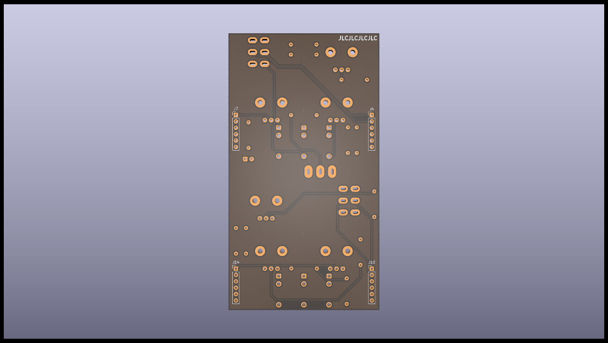

####  Finish the back by putting the trimmers, the power LED and the power connector. The LED shouldn't touch the backside of the PCB. 

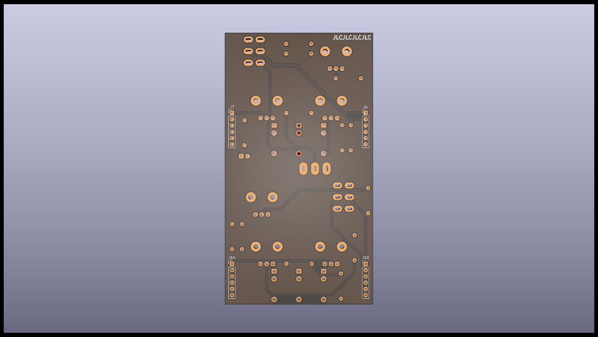

The back is done, we can flip the PCB and start the front !

#### 

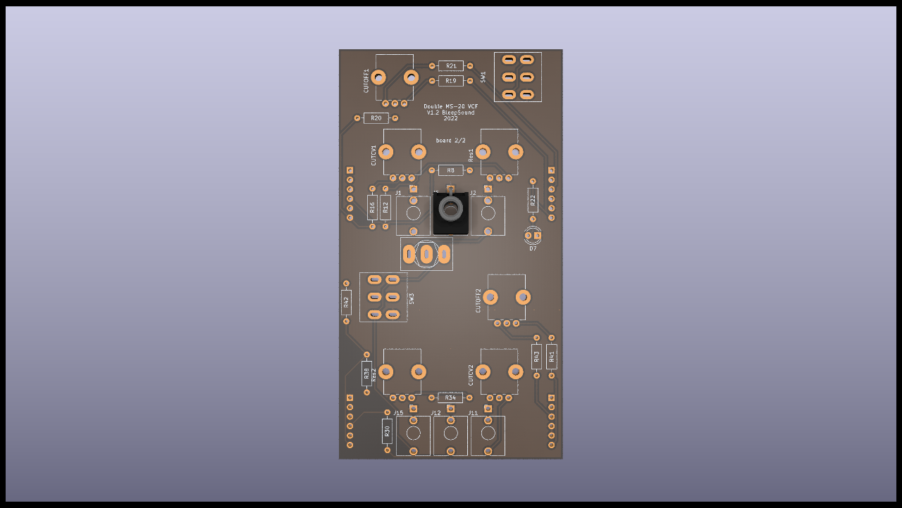

####  First, populate all the diodes.

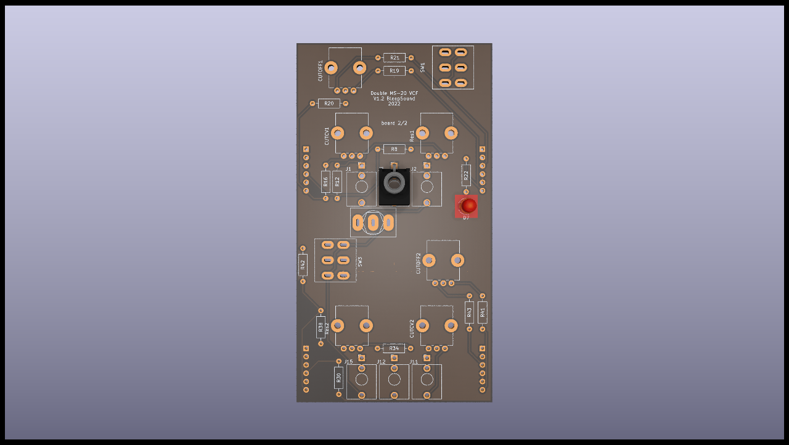

####  You then can do all the resistors (by value so you don't make mistakes)

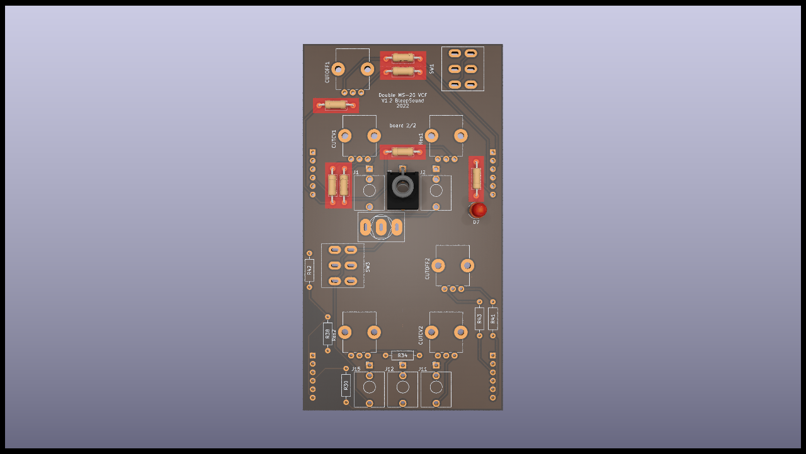

####  You then can add the transitors, watch out for their orientation.

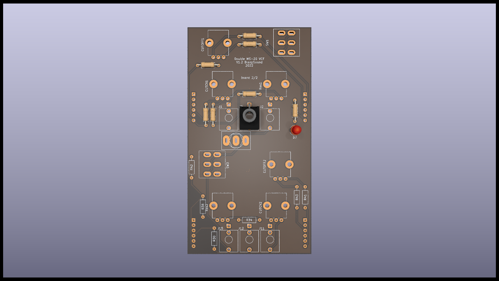

####  Add the socket for the TL072, making sure you get the orientation right. Don't add the Tl072 yet, you'll add it at the end. 

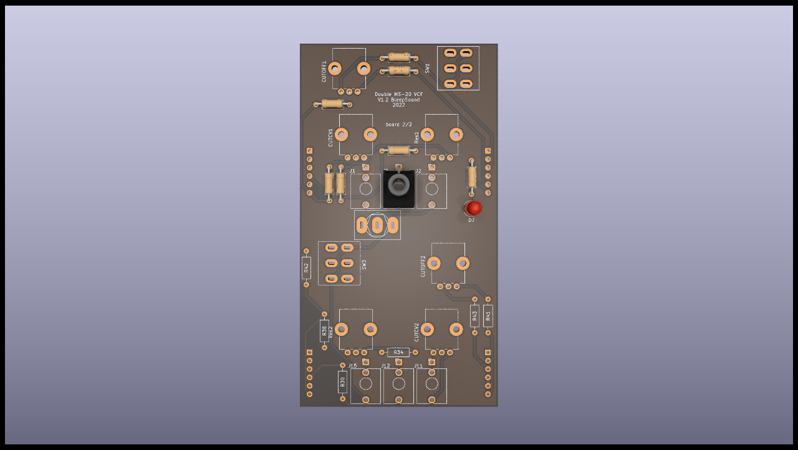

####  Add the capacitors

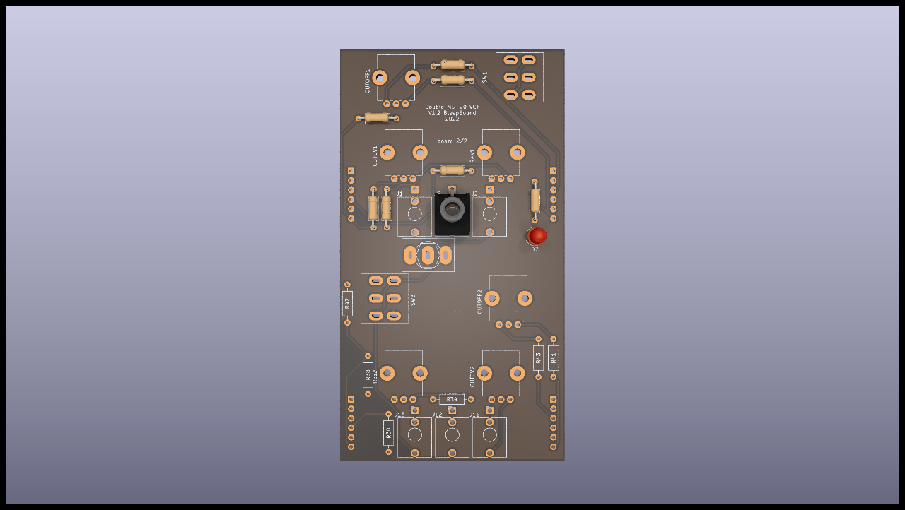

The last step concern the jacks, potentiometers and switches. Basically, anything that is accessible throught the front panel. You first place them.

:warning: DO NOT SOLDER THEM YET :warning:

(this is really important !!)

####  Do Not Solder Them! place them first and put the front panel in place. _For the pot __CUTCV1__ , use the small 100k pot (not D shaped)_  The other pots are for CUTOFF1 and Res1. You'll be able to put the" knobs of your choice on those.

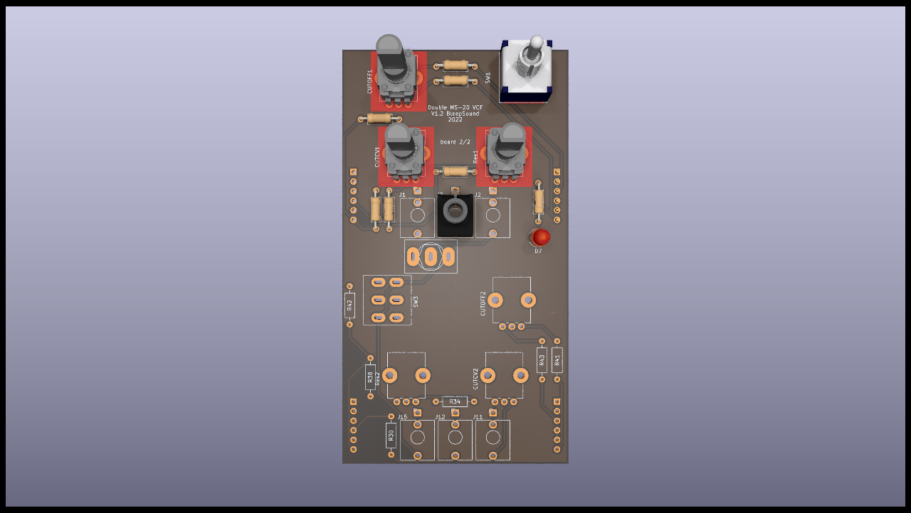

You then put in place the front panel, making sure everything fits. Once all the jack sockets and switches are fastenned to the front panel, you can solder them, and only then !!!

## Conclusion

This is the end of the build, if yoy have any questions, don't hesitate !

