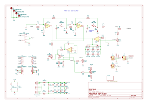
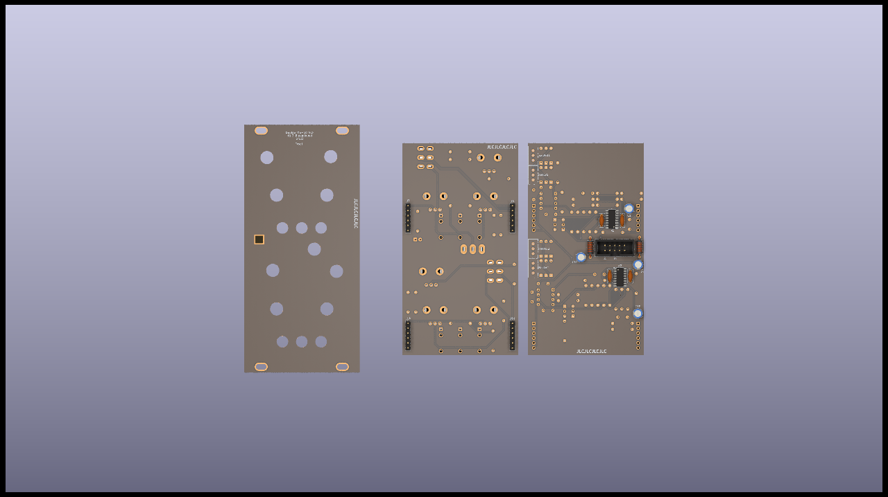

# MS20 VCF

MS20-VCF clone based on BartonSynth version.

2 filters in one with a possibility to bridge them and get a band pass filter.

When using the band pass mode, signal IN on filter 1 and out on filter 2.

cutoff + resonance, with a switch to chose low pass or high pass mode.

CV control on the filter cutoff.

Self oscilation if resonance pushed to maximum, can be adjusted with 2 trimmers :

- 1 trimmer for the sine wave amplitude (resVol)
- 1 trimmer for the level at which the knob for resonance starts the self oscillation (resLvl)

## Schematics

You'll find only the first filter below, the second filter is exactly the same.

## BoM

[See bom](documentation/bom/MS20-VCF_V1.4--iBoM.html)

You can donwload the bom in excel format [here](https://github.com/BleepSound/ms20-vcf-double/releases/download/V1.4/MS20-VCF_V1.4--BoM.xlsx).

## Build Informations

Uses an SMD LM13700 because the DIP ones are not produced anymore, hence more expensive.

Regular build, I use ceramic capacitors but you can use film/polyester.

:warning: When building modules, always do it in this order (from smallest component to highest):
- diodes
- resistors
- DIP chips
- capacitors (film/ceramic)
- Transistors
- Electrolytic capacitors

To solder the headers, place them and place both PCBs in their final position before fully soldering the pin headers/sockets.

For the next parts, always place them without soldering them on: 
- jacks, pots and switches that go throught the front panel

Once placed, put the front panel in place, then fasten all components to it. Once this is done, you can solder all the remaining components.

## Images

