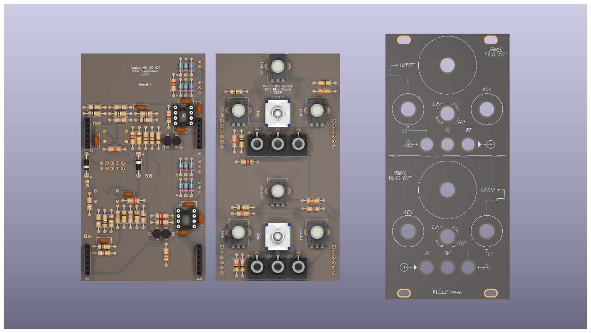
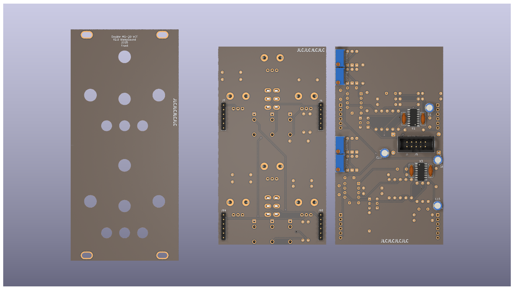
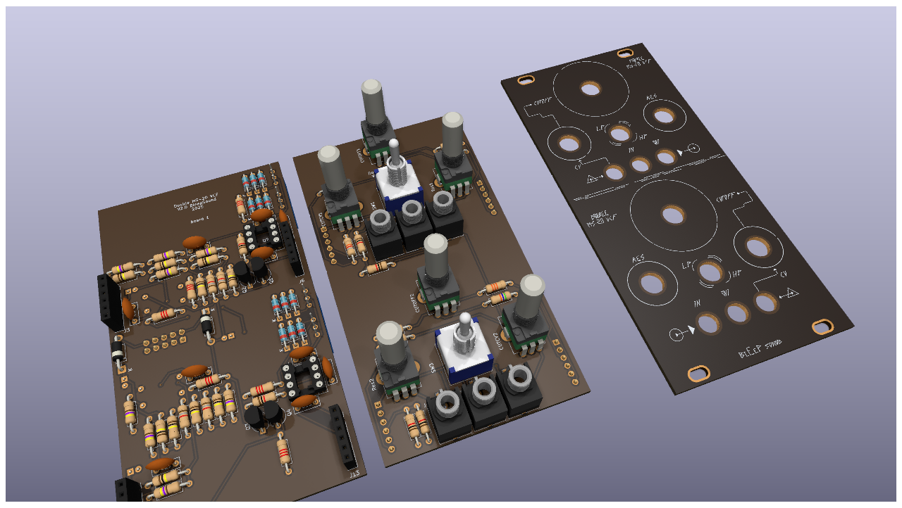

# MS20 VCF

MS20-VCF clone based on BartonSynth version.

2 filters in one with a possibility to bridge them and get a band pass filter.

When using the band pass mode, signal IN on filter 1 and out on filter 2.

cutoff + resonance, with a switch to chose low pass or high pass mode.

CV control on the filter cutoff.

Self oscilation if resonance pushed to maximum, can be adjusted with 2 trimmers :

- 1 trimmer for the sine wave amplitude (resVol)
- 1 trimmer for the level at which the knob for resonance starts the self oscillation (resLvl)

You'll find the schematic of this module below: 

Uses an SMD LM13700 because the DIP ones are not produced anymore.

Regular build, I use ceramic capacitors but you can use film/polyester.

:warning: When building modules, always do it in this order (from smallest component to highest):
- diodes
- resistors
- DIP chips
- capacitors (film/ceramic)
- Electrolytic capacitors

For the next part, always place them without soldering them on: 
- jacks, pots and switches that go thought the front panel

Once placed, put in place the front panel, then fasten all components to it. Once this is done, you can solder them. 

[See bom globale](documentation/bom/MS20-VCF-ibom-global.html)

[See bom board jack](documentation/bom/MS20-VCF-ibom-jack.html)

[See bom board circuit](documentation/bom/MS20-VCF-ibom-circuit.html)
