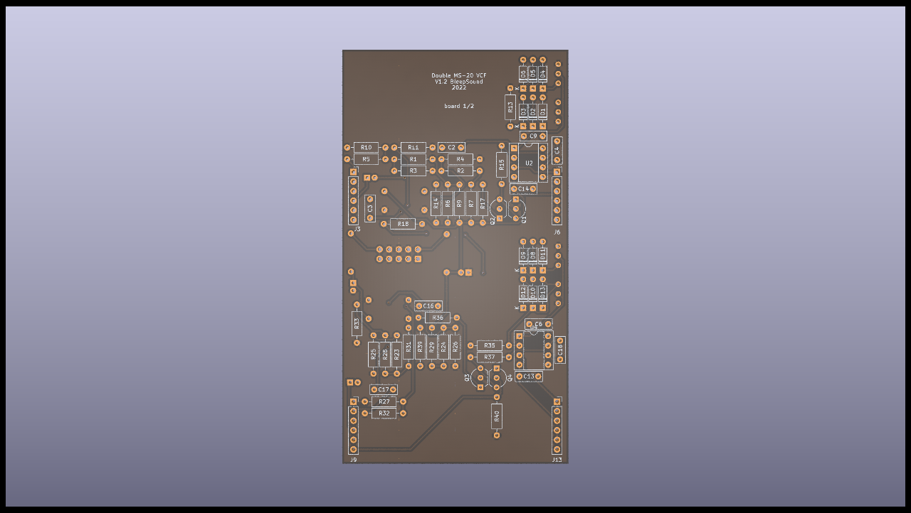
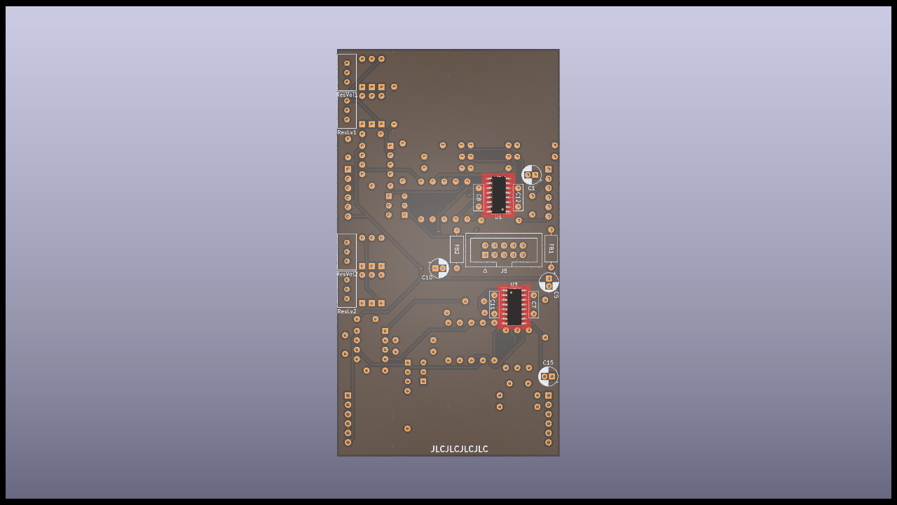
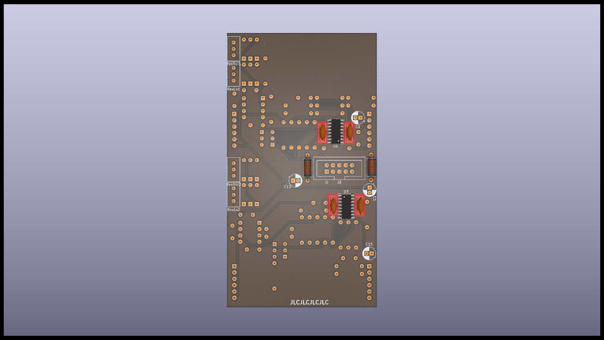
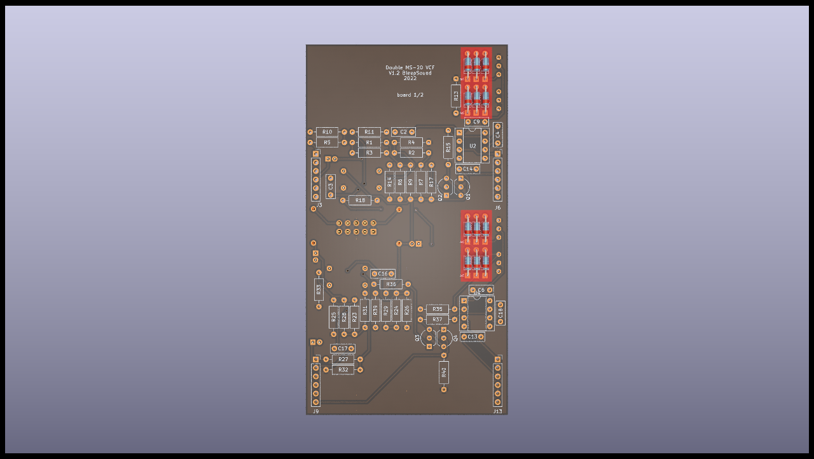
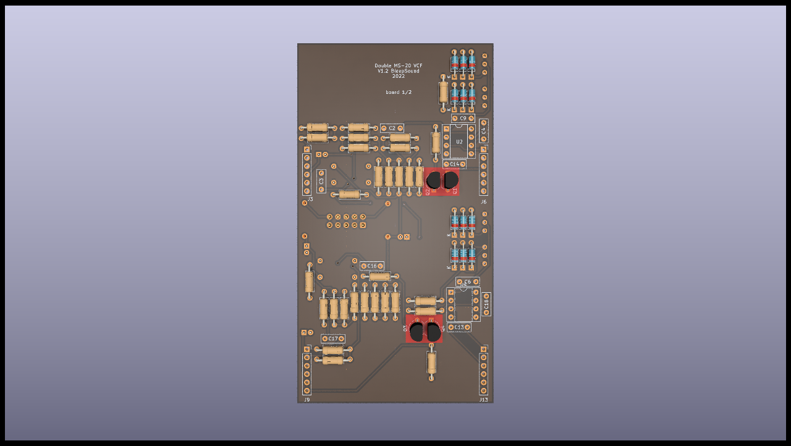

# Populate Manual for MS20-VCF-Double-circuitboard

Follow this manual to populate the PCB:

The basic rule is, always go from the smallest to the highest component on the board !

####  This is the front side of the board we are populating

####  This is the back side of the board we are populating, and we are gonna start by this side.

####  Start by the SMD components, here U1 and U3, the LM13700s.

####  After the smd components, do the beads.

####  Do all the ceramic capacitors

####  Finish the capacitors with the electrolytic ones, watch out for their orientation, they are polarized.

####  Finish the back by putting the trimmers and the power connector.

The back is done, we can flip the PCB and start the front !

#### 

####  First, populate all the diodes.

####  You then can do all the resistors (by value so you don't make mistakes)

####  You then can add the transitors, watch out for their orientation.

####  Add the socket for the TL072, making sure you get the orientation right. Don't add the Tl072 yet, you'll add it at the end.

####  Add the capacitors

## Conclusion

This is the end of the build, if yoy have any questions, don't hesitate !

