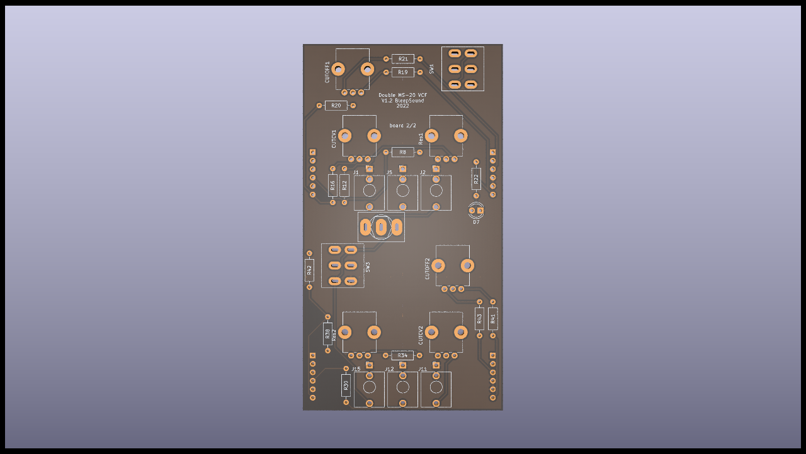
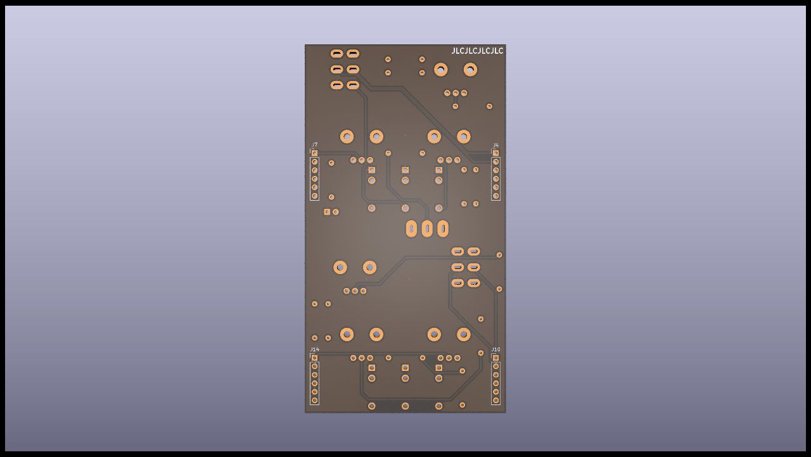
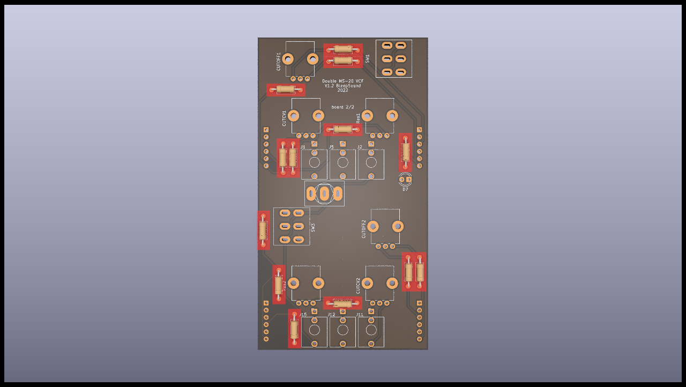
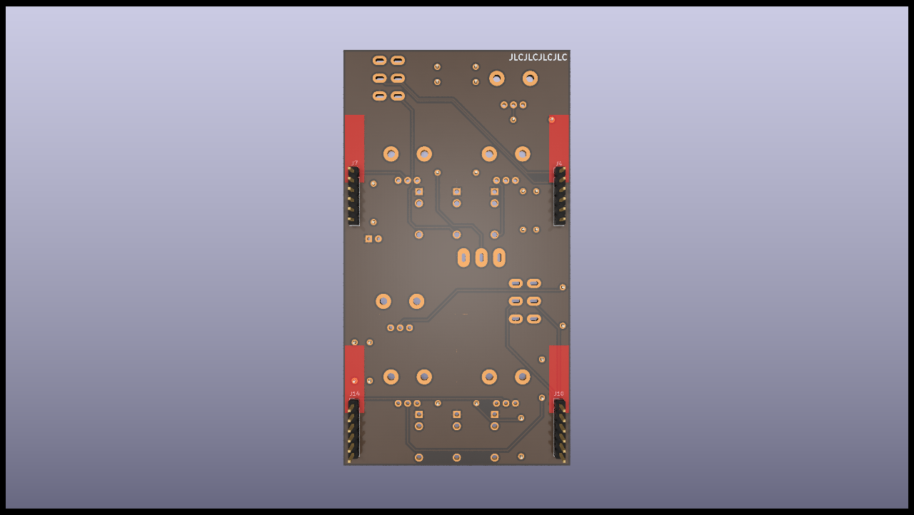
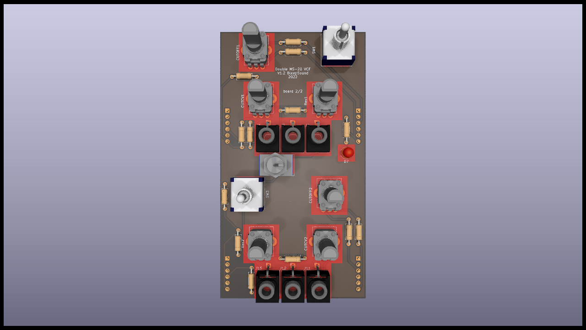

# Populate Manual for MS20-VCF-Double-jackboard

Follow this manual to populate the PCB: 

The basic rule is, always go from the smallest to the highest component on the board !

####  This is the front side of the board we are populating (we'll start there)

####  This is the back side of the board we are populating (not much there on this build)

####  We'll do all the resistors first (by value so you don't make mistakes)

We'll switch to the back:

####  just one type of components, the connectors to the circuit board. Use __Female__  connectors on this side.

The last step  concern the jacks, potentiometers and switches and front panel LEDs. Basically, anything that is accessible throught the front panel. You first place them.

:warning: DO NOT SOLDER THEM YET :warning:

(this is really important !!)

####  Do Not Solder Them! place them first and put the front panel in place. _For the pot __CUTCV1, CUTCV2__ , use the small 100k pot (not D shaped)_  The other pots are for CUTOFF1 and 2 and Res1 and 2. You'll be able to put the knobs of your choice on those. You can place the led too (D7). You'll have to place it as close as possible to the "window" on the front panel.

You then put in place the front panel, making sure everything fits. Once all the jack sockets and switches are fastenned to the front panel, you can solder them, and only then !!!

## Conclusion

This is the end of the build, if yoy have any questions, don't hesitate !

